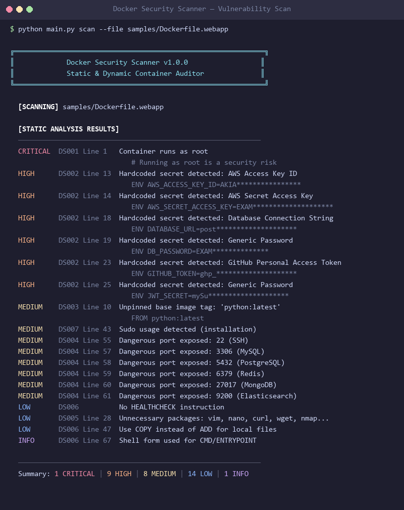
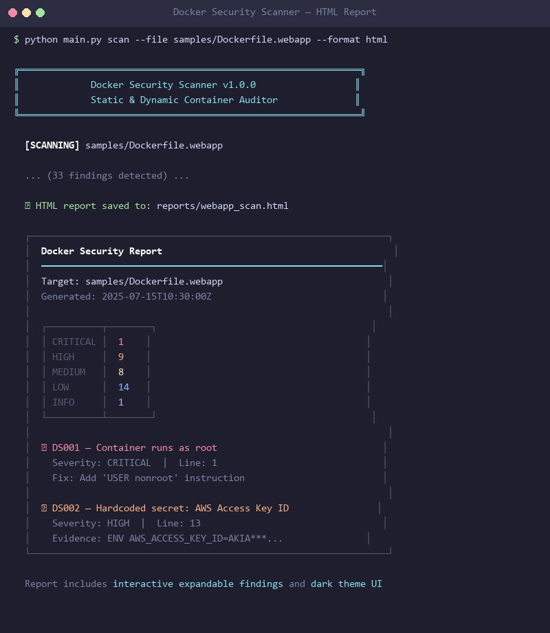
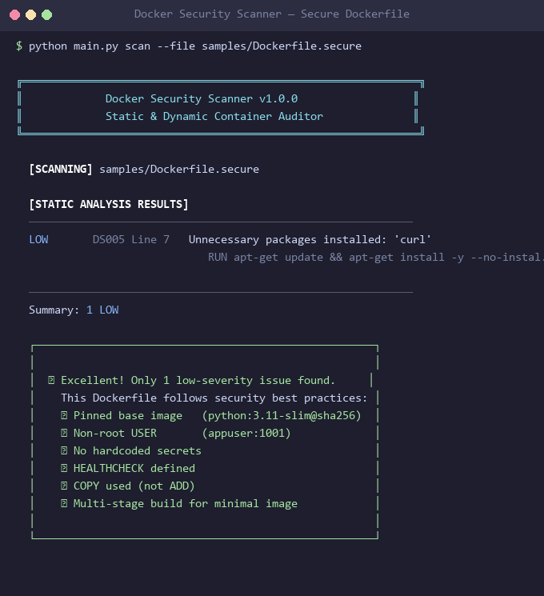
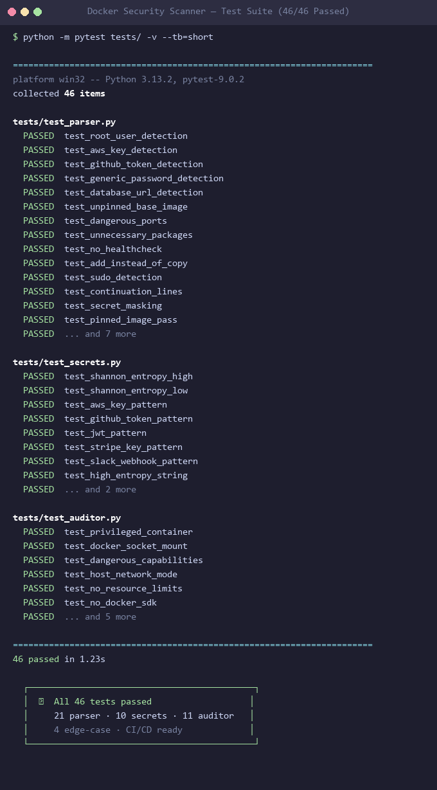
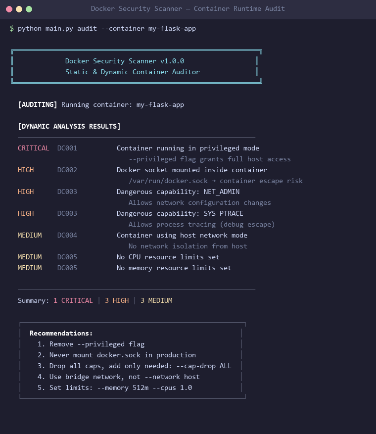

# Docker Security Scanner (DSS)

A Python-based security scanner that performs **static** and **dynamic** analysis of Docker environments to identify misconfigurations, vulnerabilities, and security anti-patterns.

Built as a learning tool for DevSecOps, VAPT, and Cloud Security concepts.


---

## Screenshots

### Terminal Scan — Vulnerable Dockerfile
> Scans a deliberately insecure Dockerfile and flags **34 security issues** across 5 severity levels.



### HTML Report — Dark-Themed Dashboard
> Standalone HTML report with severity badges, expandable remediation details, and zero external dependencies.



### Secure Dockerfile — Clean Scan
> Scanning a hardened Dockerfile returns only 1 INFO-level finding — demonstrating what a passing scan looks like.



### Test Suite — 46 Tests Passing
> Full test coverage across the parser, secret detection engine, and auditor modules.



### Dynamic Audit — Running Container Check
> Audits running Docker containers for privileged mode, socket mounts, dangerous capabilities, and missing resource limits.



---

## Features

### Static Analysis (Dockerfile Scanning)
| Check ID | Category | Description |
|----------|----------|-------------|
| `DS001` | **Privilege Escalation** | Detects containers running as root (missing `USER` directive) |
| `DS002` | **Secret Exposure** | Finds hardcoded secrets, API keys, and passwords via regex + entropy analysis |
| `DS003` | **Supply Chain** | Flags use of `:latest` or unpinned base image tags |
| `DS004` | **Network Exposure** | Identifies dangerous exposed ports (SSH, DB, admin panels) |
| `DS005` | **Attack Surface** | Detects unnecessary package managers and tools left in production images |
| `DS006` | **Build Hygiene** | Flags missing health checks, `ADD` vs `COPY` misuse, shell form CMD |
| `DS007` | **Privilege** | Catches `sudo` installation and usage inside containers |

### Dynamic Analysis (Running Container Audit)
| Check ID | Category | Description |
|----------|----------|-------------|
| `DC001` | **Container Escape** | Detects containers running in `--privileged` mode |
| `DC002` | **Host Takeover** | Finds exposed Docker socket mounts (`/var/run/docker.sock`) |
| `DC003` | **Capability Abuse** | Identifies dangerous Linux capabilities (`SYS_ADMIN`, `NET_RAW`, etc.) |
| `DC004` | **Network** | Flags containers using `--net=host` networking |
| `DC005` | **Resource** | Detects containers without memory/CPU limits |

### Secret Detection Engine
Uses a **two-layer approach**:
1. **14 regex patterns** for known providers — AWS (`AKIA...`), GitHub (`ghp_`), Slack, Stripe, Google, SSH keys, JWTs, DB connection strings
2. **Shannon Entropy analysis** — catches unknown secret formats by measuring string randomness (high entropy = likely a secret)

---

## Project Structure

```
docker-security-scanner/
├── main.py                   # CLI entry point (scan / audit / full)
├── requirements.txt
├── scanner/
│   ├── __init__.py
│   ├── dockerfile_parser.py  # Static analysis engine (7 checks)
│   ├── container_auditor.py  # Dynamic analysis via Docker SDK (5 checks)
│   ├── rules.py              # Security rules, severities, Finding dataclass
│   ├── secret_patterns.py    # Regex patterns + Shannon entropy detection
│   └── report.py             # Terminal / JSON / HTML report generation
├── samples/
│   ├── Dockerfile.vulnerable # Deliberately insecure (for testing)
│   ├── Dockerfile.webapp     # Realistic vulnerable Flask app Dockerfile
│   └── Dockerfile.secure     # Hardened best-practices example
├── tests/
│   ├── test_parser.py        # 21 tests for static analysis
│   ├── test_secrets.py       # 10 tests for secret detection
│   └── test_auditor.py       # 11 tests for dynamic auditor
├── reports/                  # Generated scan reports (JSON/HTML)
└── screenshots/              # Screenshots for README
```

---

## Quick Start

### Installation
```bash
git clone https://github.com/cazy8/docker-security-scanner.git
cd docker-security-scanner
pip install -r requirements.txt
```

### Scan a Dockerfile (Static Analysis)
```bash
python main.py scan --file samples/Dockerfile.webapp
```

### Audit Running Containers (Dynamic Analysis)
```bash
python main.py audit
```

### Generate HTML Report
```bash
python main.py scan --file samples/Dockerfile.webapp --format html --output reports/scan_report.html
```

### Generate JSON Report (for CI/CD)
```bash
python main.py scan --file samples/Dockerfile.webapp --format json --output reports/results.json
```

### Run Full Analysis (Static + Dynamic)
```bash
python main.py full --file samples/Dockerfile.webapp --output reports/full_report.html
```

### Run Tests
```bash
python -m pytest tests/ -v
```

---

## Example Terminal Output

```
╔══════════════════════════════════════════════════════════════╗
║             Docker Security Scanner v1.0.0                  ║
║             Static & Dynamic Container Auditor              ║
╚══════════════════════════════════════════════════════════════╝

  [SCANNING] samples/Dockerfile.webapp

  [STATIC ANALYSIS RESULTS]
  ────────────────────────────────────────────────────────────
  CRITICAL  DS001 Line 1   Container runs as root
  HIGH      DS002 Line 13  Hardcoded secret detected: AWS Access Key ID
                           ENV AWS_ACCESS_KEY_ID=AKIA****************
  HIGH      DS002 Line 18  Hardcoded secret detected: Database Connection String
                           ENV DATABASE_URL=post********************
  HIGH      DS002 Line 23  Hardcoded secret detected: GitHub Personal Access Token
                           ENV GITHUB_TOKEN=ghp_********************
  HIGH      DS002 Line 24  Hardcoded secret detected: Stripe Secret Key
                           ENV STRIPE_SECRET_KEY=sk_l********************
  MEDIUM    DS003 Line 10  Unpinned base image tag: 'python:latest'
  MEDIUM    DS004 Line 55  Dangerous port exposed: 22 (SSH)
  MEDIUM    DS004 Line 57  Dangerous port exposed: 3306 (MySQL)
  LOW       DS005 Line 28  Unnecessary packages installed: 'nmap'
  LOW       DS006 Line 47  Use COPY instead of ADD for local files
  INFO      DS006 Line 67  Shell form used for CMD/ENTRYPOINT

  ────────────────────────────────────────────────────────────
  Summary: 1 CRITICAL | 10 HIGH | 8 MEDIUM | 14 LOW | 1 INFO
```

---

## How It Works

```
python main.py scan --file Dockerfile
           │
           ▼
    ┌──────────────┐
    │   main.py    │  CLI router (argparse)
    └──────┬───────┘
           │
    ┌──────┴──────────┐
    ▼                 ▼
┌──────────┐   ┌──────────────┐
│ Static   │   │ Dynamic      │
│ Parser   │   │ Auditor      │
│ (7 rules)│   │ (5 rules)    │
└────┬─────┘   └──────┬───────┘
     │                │
     │  Finding()     │  Finding()
     ▼                ▼
    ┌──────────────────┐
    │   report.py      │
    │ Terminal/JSON/HTML│
    └──────────────────┘
```

1. **Parser** reads the Dockerfile line-by-line
2. **7 independent checks** run against each line (root user, secrets, base image, ports, packages, best practices, sudo)
3. **Secret detection** uses 14 regex patterns + Shannon Entropy fallback
4. **Dynamic auditor** queries Docker SDK for running container configs
5. **Findings** are sorted by severity and rendered to terminal + optional file output
6. **Exit code** is non-zero if CRITICAL/HIGH issues exist (CI/CD integration)

---

## Security Concepts Covered

| Concept | Implementation |
|---------|---------------|
| **CIS Docker Benchmark** | Every rule references a CIS control ID |
| **Principle of Least Privilege** | DS001 (non-root), DS007 (no sudo), DC003 (minimal capabilities) |
| **Supply Chain Security** | DS003 — Pin image versions to prevent upstream compromise |
| **Secret Management** | DS002 — Regex + entropy detection; remediation points to Vault/AWS Secrets Manager |
| **Container Escape** | DC001 (privileged mode) + DC002 (Docker socket) — top 2 real-world breakout vectors |
| **Shannon Entropy** | Information theory formula used in cryptography to detect high-randomness secrets |
| **Defense in Depth** | Static catches issues pre-build; dynamic catches runtime misconfigs |
| **CI/CD Integration** | Non-zero exit code on CRITICAL/HIGH findings for pipeline gating |

---

## Technologies

- **Python 3.8+** — Core language
- **Docker SDK for Python** — Container runtime inspection
- **Regular Expressions** — 14 provider-specific secret patterns
- **Shannon Entropy** — Information-theoretic secret detection
- **argparse** — CLI interface
- **pytest** — Test framework (46 tests)

---

## Comparison with Industry Tools

| Feature | DSS (This Tool) | Trivy | Docker Bench | Clair |
|---------|-----------------|-------|--------------|-------|
| Dockerfile Static Analysis | ✅ | ✅ | ❌ | ❌ |
| Running Container Audit | ✅ | ❌ | ✅ | ❌ |
| Secret Detection (Regex) | ✅ | ✅ | ❌ | ❌ |
| Secret Detection (Entropy) | ✅ | ❌ | ❌ | ❌ |
| CVE Database Scanning | ❌ | ✅ | ❌ | ✅ |
| HTML Reports | ✅ | ✅ | ❌ | ❌ |
| CI/CD Exit Codes | ✅ | ✅ | ✅ | ✅ |
| Zero Dependencies (Static) | ✅ | ❌ | ❌ | ❌ |

---

## Contributing

1. Fork the repository
2. Create a feature branch (`git checkout -b feature/new-check`)
3. Add your security check in `scanner/rules.py` and `scanner/dockerfile_parser.py`
4. Write tests in `tests/`
5. Run `python -m pytest tests/ -v` to verify
6. Submit a Pull Request

---

## License

MIT License — See [LICENSE](LICENSE) for details.
